## TYPHP

[](https://travis-ci.com/seferov/typhp)

`typhp` is a simple tool checks whether type hint for arguments or return type declared.
Unlike static analysis tools, it doesn't point out possible errors and issues
but suggests typehint everything possible.

#### For whom?
- Who works projects using PHP 7.1 and higher. 
- Who doesn't want to point out missing type hint and return type declarations in code review process
by using it as part of CI pipeline.
- Who love strict typing and defensive programming.

#### Features

- Respects phpdoc; there are some rare cases mixed or compound types are needed.
If such cases documented in phpdoc, `typhp` doesn't complain. For example: `@return array|bool`, `@param mixed $foo`, etc.
- Takes [magic methods](https://www.php.net/manual/en/language.oop5.magic.php) into account.
- Analyses based on configuration. Include/exclude files and directories to be analysed.
For optional config file, see the [current project example](https://github.com/seferov/typhp/blob/master/.typhp.yml)
- Does NOT modifies your code

## Installation


There are several ways to install `typhp`. The recommended one is to use
phar distribution. Thus you won't have possible dependency conflict.

#### Phar

Direct download from the [latest Github release](https://github.com/seferov/typhp/releases/latest)

```bash
wget https://github.com/seferov/typhp/releases/download/v0.1.2/typhp.phar -O typhp
chmod +x typhp
```

You can install phar distribution by [Phive](https://phar.io/)

```bash
phive install seferov/typhp --global
```

#### Composer

`typhp` can be installed by [composer](https://getcomposer.org/) globally.

```bash
composer global require seferov/typhp
```

If you prefer, you can it add dev dependency to your project.

```bash
composer require require seferov/typhp --dev
```

## Usage

`
typhp analyse path
`

If config file (`.typhp.yml`) is present in project root, it can be run
just by `vendor/bin/typhp`

Example output



## Todo

- [x] Analyse closures

- [ ] Check by PHP version. For example, don't suppress `@param object` for >= PHP 7.2

- [ ] Better configuration
 
- [ ] Check `declare(strict_types=1)` by config

- [x] Phar file

- [ ] Auto deploy phar file to release assets & add self-update command

- [ ] Github Actions


## Issues

Since it is a beta release, there might be some issues. If you found one, please submit it [here](https://github.com/seferov/typhp/issues/new)
